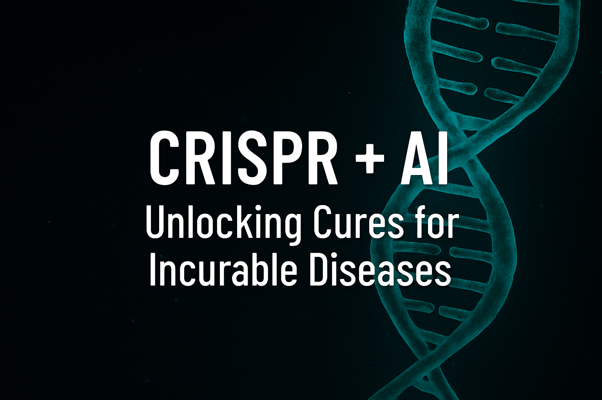

<p align="center">
  
</p>

# 🧬 CRISPR + AI Simulator v6

**Creator:** Patience Bambu  
**Version:** v6  
**Purpose:** To simulate CRISPR-based gene editing using AI-enhanced predictions, delivery success modeling, and immune response estimation.

This platform allows you to:
- Paste DNA or upload real gene sequences
- Predict and score gRNAs
- Simulate delivery success and immune response
- Visualize simulated gene editing
- Export PDF experiment reports
- Fetch real gene data from Ensembl
- Enjoy interactive UI with branding and animations
- Collect emails for future updates

## Features
- 🎯 AI-powered gRNA scoring
- 📦 Delivery vector simulation
- 🛡️ Immune risk prediction
- 📄 Exportable PDF report
- 🔬 Real gene fetch from Ensembl
- 🧬 Visual gene editing preview
- 📥 FASTA upload support
- 🎨 Streamlit animations & branding

## How to Run
1. Install dependencies:
```bash
pip install -r requirements.txt
```

2. Launch the app:
```bash
streamlit run crispr_editor_app_v6.py
```

## Folder Contents
- `crispr_editor_app_v6.py`: Main Streamlit application
- `requirements.txt`: Required Python packages
- `README.md`: You're reading it
- `/assets`: Logos, diagrams, animations, delivery legends

---

🚀 **Built with passion by Patience Bambu to revolutionize precision gene editing.**
